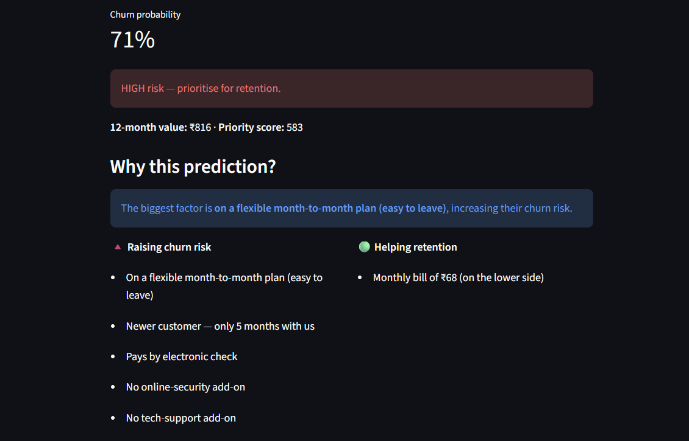
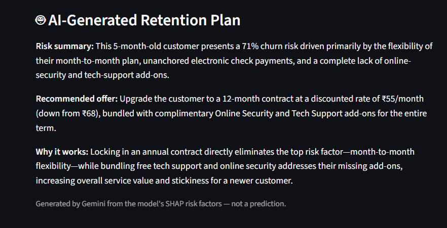

# Telecom Customer Churn Prediction & Retention ROI

### 🔗 [Live Demo](https://lavish-churn-predictor.streamlit.app/)





Predicts which telecom customers will churn, explains *why* (SHAP), and ranks
which high-value customers to retain — with an ROI estimate for the campaign.

## Problem
Retaining a customer is cheaper than acquiring one. This project flags at-risk
customers *before* they leave and prioritizes retention spend by revenue at risk.

## Dataset
Telco Customer Churn (7,043 customers, 26.5% churn — imbalanced).

## Approach
1. **EDA** — churn driven by contract type, tenure, monthly charges
2. **Preprocessing** — cleaned TotalCharges, one-hot encoding, scaling, stratified split (no leakage)
3. **Models** — Logistic Regression, Random Forest, XGBoost compared via 5-fold CV
4. **Tuning** — GridSearchCV on XGBoost (best model)
5. **Explainability** — SHAP (global + per-customer)
6. **Retention ROI** — rank by churn_prob × customer value, simulate campaign ROI

## Results
| Model | ROC-AUC | Recall (Churn) |
|-------|---------|----------------|
| Logistic Regression | 0.842 | 0.78 |
| Random Forest | 0.820 | 0.62 |
| **XGBoost (tuned)** | **0.845** | **0.79** |

- Evaluated on **recall / ROC-AUC** (not accuracy) due to class imbalance
- Top churn drivers: month-to-month contract, low tenure, high charges
- **Decision threshold: 0.35**, chosen by sweeping thresholds against the retention cost model
  (offer \$50, 30% success rate) on the test set. Net value is fairly flat between 0.30 and 0.45.
- **Retention ROI: ~226%** (on stated assumptions). Scored only *active* (non-churned) customers
  from the held-out test set (1,035), targeting the 391 the model flags at ≥ 0.35:
  \$19,550 spend → ~\$63.7k expected revenue saved.

> **Note — risk scores, not probabilities.** The model is trained with `scale_pos_weight`
> to handle class imbalance, so its outputs are *uncalibrated risk scores*: they rank customers
> well (ROC-AUC 0.845) but run high as probabilities (mean score 0.41 vs. actual churn rate
> 0.27 on the test set). The "churn probability" shown in the app and the expected-value ROI
> above should be read as relative risk, and the ROI figure is likely optimistic.

## Tech
Python, pandas, scikit-learn, XGBoost, SHAP, matplotlib/seaborn

## Files
- `churn_prediction.ipynb` — full analysis, phase by phase
- `at_risk_customers.csv` — ranked retention list (output)
- `churn_model.joblib`, `preprocessor.joblib` — saved model + preprocessor

## How to run
```
pip install -r requirements.txt
```

**Streamlit app**
```
# optional, enables the AI retention plan — create a .env file containing:
#   GEMINI_API_KEY=your-key-here
# (on Streamlit Cloud, set GEMINI_API_KEY in the app's Secrets instead)
streamlit run app.py
```
Without a key the app still runs; only the AI retention plan is disabled.

**Notebook**
```
pip install jupyterlab
jupyter lab   # open churn_prediction.ipynb and run all
```

## Scope

- **Phase 1 (complete):** churn model, evaluation, SHAP explainability, retention-ROI ranking, Streamlit demo.
- **Phase 2A (complete):** LLM retention-action generator — Gemini turns the model's SHAP risk factors into a written retention plan with a specific recommended offer.
- **Phase 2B (not implemented):** RAG offer matcher — see Future scope.

## Phase 2A — LLM Retention-Action Generator ✅

Built on top of the Phase 1 model (XGBoost still does all prediction; the LLM only explains and recommends).

- Takes the customer's churn probability + SHAP risk factors → generates a structured retention plan
- Prompt engineered with explicit role, context, constraints, and output format
- Anti-hallucination constraint: the model may only reason from the provided risk factors
- Fail-fast model-fallback chain across four Gemini Flash models: on any API error (busy, rate-limited, unavailable) the app immediately tries the next model, with no backoff, to keep latency low
- Successful responses are cached for an hour; failures are not cached, so the next click retries
- API key stored in `.env` (git-ignored), never committed

## Future scope (not implemented)

- **RAG offer matcher** — embed a real offer catalogue in a vector store, retrieve the best-fit offers, and have the LLM select from them instead of generating offers freely.
- Structured JSON output from the LLM.
- Uplift modeling / contextual bandit for offer selection.
- Deployment as a Spring Boot API + Python model microservice.